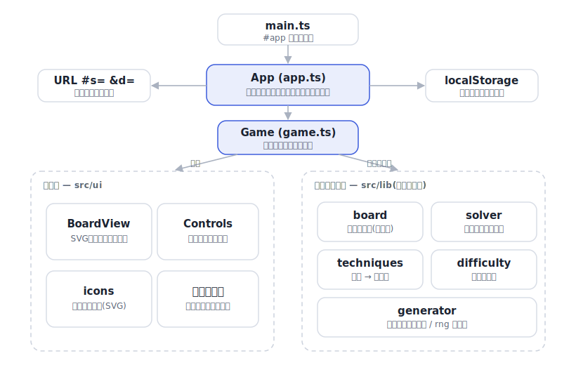

# nanpure

[](https://github.com/miruky/nanpure/actions/workflows/ci.yml)
[](https://github.com/miruky/nanpure/actions/workflows/deploy.yml)
[](https://www.typescriptlang.org/)
[](LICENSE)

**ブラウザで解く数独。問題の生成・求解・難易度判定をすべて自前のロジックで行い、詰まったら「次の一手」とその理由を示す**

デモ: https://miruky.github.io/nanpure/

## 概要

nanpureは数独を、サーバーなしでブラウザ内に閉じて実装したものである。難易度を選ぶとその場で問題を生成し、マスをクリックかキーボードで埋めていく。誤った数字を置くとミスとして数え、同じ数字や同じ行・列・ブロックを薄く強調する。メモ(候補の鉛筆書き)は手書きのほか、空きマスへ候補を一括で書き込む自動メモも用意した。取り消しとやり直し、経過時間、ライト/ダーク表示に対応し、進行中の局はlocalStorageに残るので閉じても続きから再開できる。クリアすると難易度ごとの最短時間・クリア数・ノーミス連勝を成績として記録し、自己ベストを更新したときはその場で知らせる。

生成した問題は必ず解がただ1つになる。完成盤面を作ってからヒントを少しずつ抜き、抜くたびに解の一意性を確かめ、崩れる抜き方は採用しない。見た目を整えるため既定では180度回転対称に抜く。さらに、抜いた後の盤面が選んだ難易度より難しくなりそうなら抜くのをやめるので、やさしい問題が偶然の難問になることはない。

難易度は「解くのに最後まで必要だったテクニックの難しさ」で測る。盤面を人間と同じ手筋(裸の単数・隠れた単数・ロックド候補・裸/隠れのペアとトリプル)で解き進め、どこまで使えば解けるかを見る。同じ手筋のエンジンがヒント機能も兼ねていて、行き詰まったときは次に確定できるマスや消せる候補を、根拠の文付きで教える。乱数はシードで動くため、URLにシードと難易度を載せれば相手の画面に同じ問題が開く。

### なぜ作ったのか

数独そのものは珍しくないが、「自前で問題を作る」と「その難しさを言葉で説明する」を真面目にやると一気に手応えが出る。一意解を保ったままヒントを抜くには高速なソルバーと解の数え上げが要るし、難易度を空きマス数ではなく実際の手筋で測ろうとすると、人が使う解法を一通り実装する必要がある。既存のWeb数独は難易度がマスの数で決まっていたり、ヒントが答えを置くだけで理由を言わなかったりするものが多い。解いている最中に「なぜそのマスがそう決まるのか」を示してくれる学習向けの数独が欲しくて作った。ロジックは描画から完全に切り離し、解の一意性・生成の正しさ・難易度判定をテストで担保している。

## アーキテクチャ



`src/lib` はDOMに触れない純粋なロジックで、盤面の表現・求解・テクニック判定・難易度・生成がここで完結する。`src/game.ts` が1局分の状態(入力・メモ・履歴)を持ち、`src/ui` と `src/app.ts` がその上に画面を載せて、URLとlocalStorageへの出入りを受け持つ。

## 技術スタック

| カテゴリ             | 技術                                  |
| :------------------- | :------------------------------------ |
| 言語                 | TypeScript 5(strict、実行時依存ゼロ)  |
| ビルド               | Vite 6                                |
| テスト               | Vitest(node + happy-dom)              |
| リンタ・フォーマッタ | ESLint(typescript-eslint)+ Prettier   |
| CI / 配信            | GitHub Actions / GitHub Pages         |

## 使い方

### 遊ぶ

難易度(やさしい・ふつう・むずかしい・エキスパート)を選ぶと問題が始まる。マスを選び、画面下の数字パッドかキーボードの `1`–`9` で数字を入れる。主な操作は次のとおり。

- `1`–`9` 数字を入力(同じ数字をもう一度押すと取り消す)
- `0` / `Backspace` / `Delete` マスを消す
- 矢印キー 選択マスを移動
- `p` メモモードの切り替え(候補を小さく書き込む)
- `f` 空きマスに候補を一括でメモする(自動メモ)
- `h` ヒント(次の一手と理由を表示し、その場で適用できる)
- `u` 取り消し
- `?` 操作説明を開く

ヘッダから新しい問題の生成、中断、共有、成績、操作説明、テーマ切り替えができる。共有を押すと、いま解いている問題を開くリンクがクリップボードにコピーされる。成績には難易度ごとの最短時間とクリア数、ノーミス連勝が残る。

### 問題を解く(ライブラリ)

ロジックは `src/lib` から型付きで使える。盤面は81文字の文字列(空きは `.` か `0`)で受け渡す。

```ts
import { parseGrid, serializeGrid, solve } from './src/lib';

const grid = parseGrid(
  '53..7....6..195....98....6.8...6...34..8.3..17...2...6.6....28....419..5....8..79',
);
const solved = solve(grid);
serializeGrid(solved!); // '534678912672195348198342567859761423426853791713924856961537284287419635345286179'
```

### 問題を生成する

```ts
import { generate, serializeGrid } from './src/lib';

const puzzle = generate({ difficulty: 'hard', seed: 1 });
puzzle.difficulty; // 'hard'
puzzle.clues; // 初期ヒントの数
serializeGrid(puzzle.puzzle); // 一意解を持つ初期盤面
serializeGrid(puzzle.solution); // その唯一の解
```

`seed` を省略すると毎回違う問題になる。同じ `seed` と難易度からは必ず同じ問題が再現されるので、テストや共有に使える。

### 難易度を判定する

```ts
import { parseGrid, rateDifficulty } from './src/lib';

const rating = rateDifficulty(parseGrid('...'));
rating.level; // 'easy' | 'medium' | 'hard' | 'expert'
rating.solvedLogically; // 推測なしで解けるか(false ならエキスパート)
rating.techniquesUsed; // 解く過程で必要になった手筋の一覧
```

### 次の一手を求める(ヒント)

```ts
import { candidates, nextStep, parseGrid } from './src/lib';

const grid = parseGrid('...');
const step = nextStep(grid, candidates(grid));
step?.technique; // 'naked-single' | 'hidden-single' | 'locked-pointing' | ...
step?.explain; // 「3行5列 は候補が 7 だけなので確定する。」
step?.placements; // 確定できるマス [{ cell, digit }]
step?.eliminations; // 消せる候補 [{ cell, digit }]
```

## プロジェクト構成

- `src/lib/board.ts` 盤面の表現、ユニットとピアの事前計算、候補のビットマスク、整合・競合判定、文字列との相互変換
- `src/lib/rng.ts` シード付き擬似乱数。再現可能な生成と共有の核
- `src/lib/solver.ts` 制約伝播つきバックトラッキング。求解と解の一意性判定
- `src/lib/techniques.ts` 人間の解法テクニックと、次の一手の導出(ヒントの実体)
- `src/lib/difficulty.ts` 必要だった手筋の段階による難易度判定
- `src/lib/generator.ts` 一意解を保ちながら掘る問題生成、難易度の上限制御
- `src/game.ts` 1局分の状態・入力・メモ(手書き/自動)・取り消し履歴・直列化
- `src/stats.ts` クリア成績(難易度別の最短時間・クリア数・ノーミス連勝)の集計
- `src/ui/board.ts` SVG盤面の描画と強調表示
- `src/ui/controls.ts` 数字パッドと操作ボタン
- `src/ui/icons.ts` 操作アイコン(currentColorのSVG)
- `src/app.ts` 画面の統括(タイマー・テーマ・共有・保存・難易度選択・成績・操作説明)
- `src/share.ts` 問題をURLへ載せる共有エンコード
- `src/storage.ts` 設定・進行中の局・成績を保存するlocalStorageの薄い層
- `docs/` アーキテクチャ図

## はじめ方

### 前提条件

- Node.js 22以上

### セットアップ

```bash
git clone https://github.com/miruky/nanpure.git
cd nanpure
npm ci
npm run dev
```

### テスト・lint・ビルド

```bash
npm test
npm run lint
npm run build
```

テストは、盤面モデルの不変条件、ソルバーの正しさ(既知の問題の解・一意性判定・矛盾盤面の検出)、各テクニックの検出、難易度判定の妥当性、生成した問題が一意解を持ち報告どおりの難易度になること、局の状態(入力・ミス計上・undo/redo・直列化)、成績の集計(自己ベスト更新・ノーミス連勝・保存値の正規化)、そしてUIが実際に81マスを描画し操作に反応することを検査する。

### デプロイ

mainへのpushで `deploy.yml` がGitHub Pagesへ公開する。サブパス配信のためのbaseは環境変数 `NANPURE_BASE` で渡す。

## 制約

- 難易度は手筋の段階で測る。生成は試行回数の上限内で目標に最も近い問題を返すため、ごく稀に1段やさしい(または難しい)問題になることがある。
- 実装している手筋は、裸の単数・隠れた単数・ロックド候補(ポインティング/クレーミング)・裸/隠れのペアとトリプルまで。X-Wingやスウォードフィッシュのような高度な技は入れていない。それらが要る局面はエキスパート(論理だけでは進めない)として扱う。
- ヒントは現在プレイヤーが置いた値から候補を計算する。誤った数字を置いたままだと、その矛盾に基づいた手は出せない。
- 進行中の局と設定は端末のlocalStorageに保存する。別の端末やブラウザへは引き継がれない。
- 共有リンクに載るのはシードと難易度だけで、途中まで埋めた盤面そのものは送らない。

## 設計方針

- **ロジックと描画を分ける** — `src/lib` はDOMを一切参照せず、盤面・ソルバー・テクニック・難易度・生成だけで完結する。おかげで解の一意性や難易度判定をnode環境のテストで直接検証でき、UIはその純粋な核に薄く載るだけで済む。
- **テクニックエンジンを難易度とヒントで共用する** — 「人間の手筋で次の一手を出す」一つの仕組みを、難易度判定(どこまでの手筋が要るか)とヒント(その一手を見せる)の両方で使う。同じ判断を二度実装しないので、難しさの定義とヒントの内容が必ず一致する。
- **候補をビットマスクで持ち、制約伝播で絞る** — 各マスの取りうる数字を9ビットで表し、確定のたびにピアからの除去とユニット内の唯一の置き場所を伝播させる。集合演算がビット演算になり、求解も手筋判定も軽くなる。
- **生成は一意性を保ったまま掘る** — 完成盤面からヒントを抜くたびに解がただ1つかを確かめ、さらに目標難易度を超えそうなら抜くのをやめる。これで「解が定まらない問題」も「やさしいはずが難問」も避けられる。
- **シードで再現する** — 乱数はシード付きで動かし、問題はシードと難易度から完全に再現できる。共有リンクが短く済み、テストも決定的に書ける。

## ライセンス

[MIT](LICENSE)
